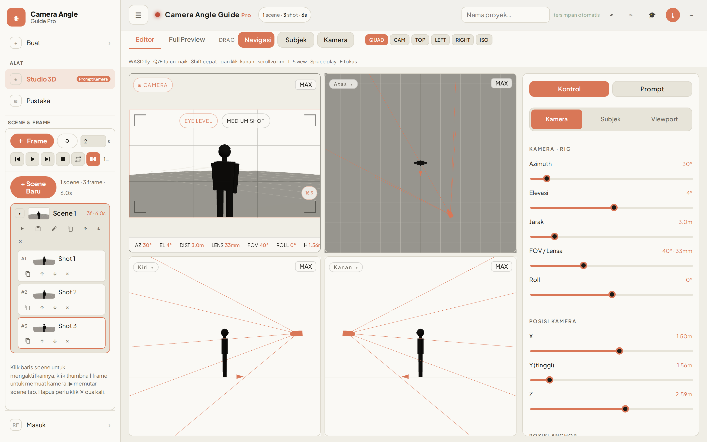
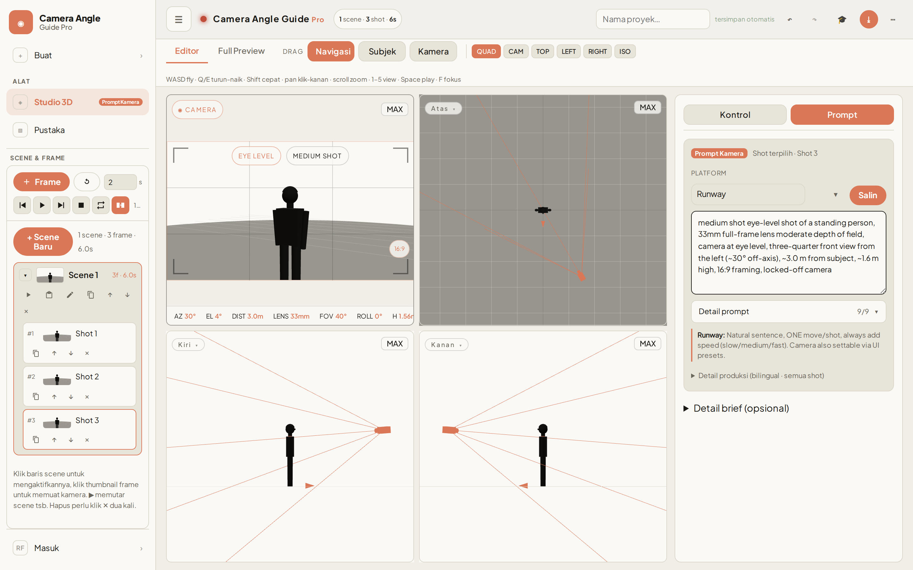
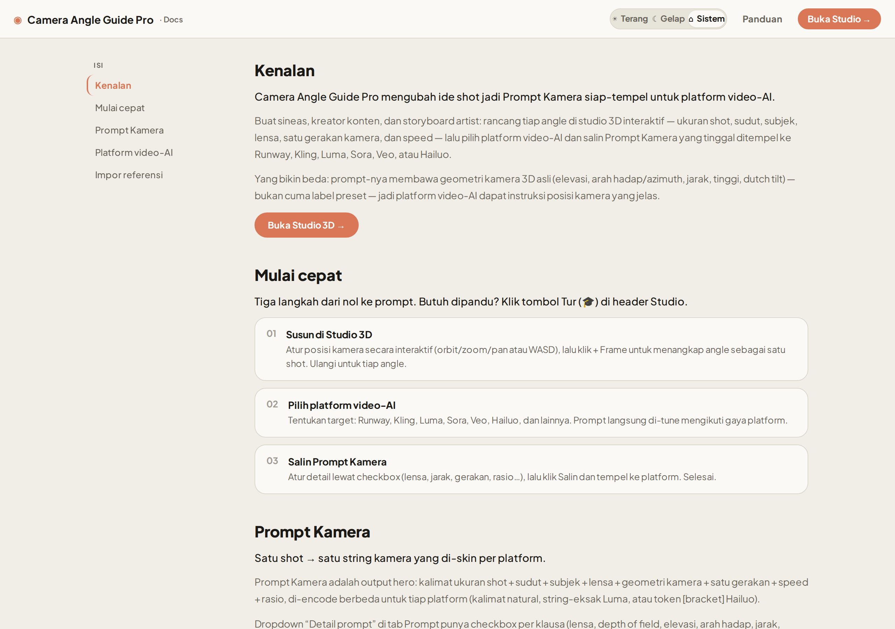
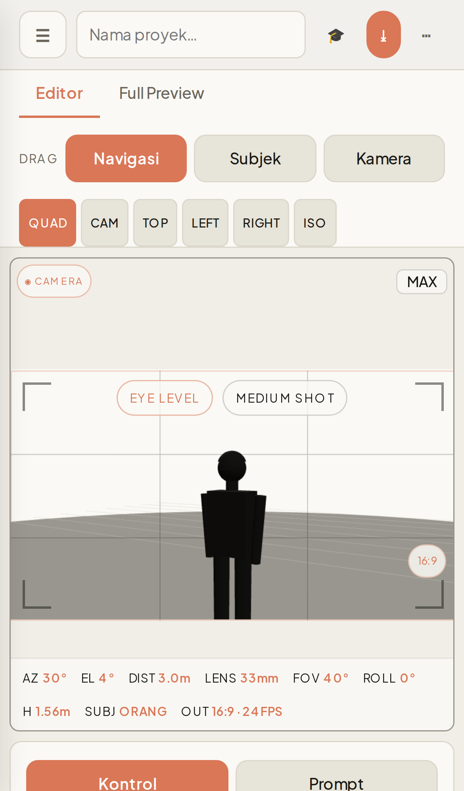
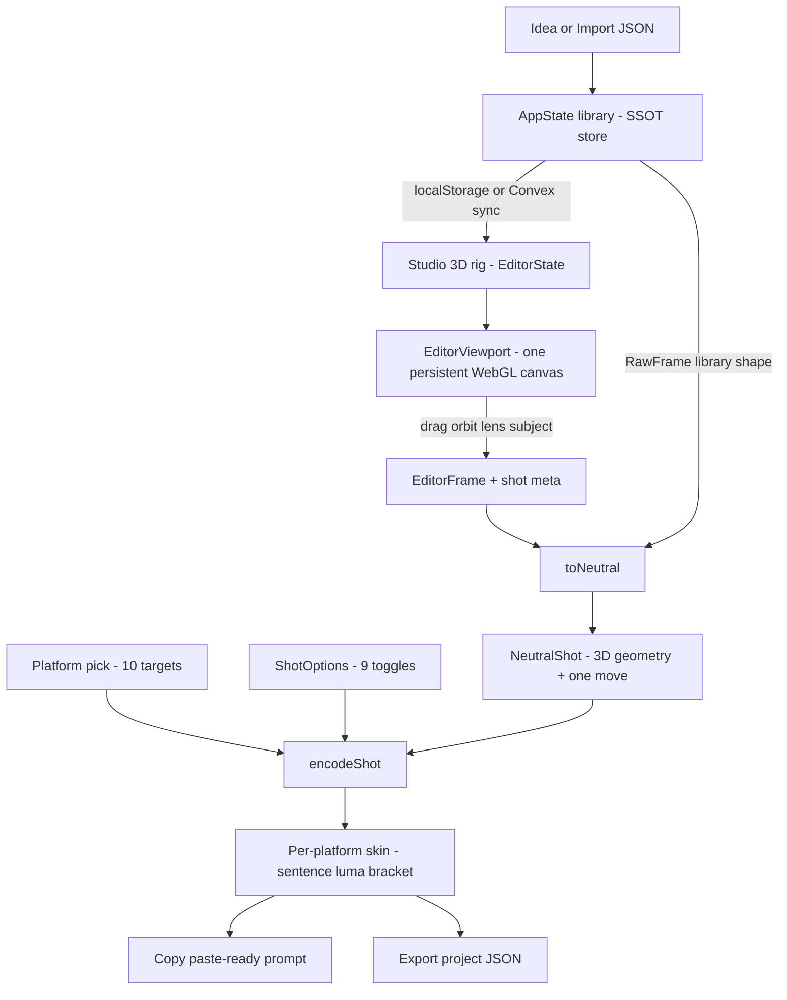

# Camera Angle Guide Pro

> Plan camera shots in an interactive 3D studio, then export platform-tuned prompts for AI video models.

<div align="center">



**[Live → frame-pilot.rahmanef.com](https://frame-pilot.rahmanef.com)**


</div>

---

## What it does

Camera Angle Guide Pro (package `camera-angle-guide-data-prompt`) turns the vague job of "describe the shot you want" into a concrete, repeatable workflow. You block out a shot in a real 3D viewport — orbit the camera, set the lens, place the subject — and the app reads that camera geometry back out as a paste-ready prompt, re-skinned for whichever AI video platform you target.

Because the shot is real 3D data (azimuth, elevation, distance, roll, FOV, subject transform), the same intent can be re-encoded for **10 different platforms** without you rewriting a word. Anonymous use runs entirely on `localStorage`; sign in and your projects sync to Convex Cloud.

The UI is in **Bahasa Indonesia**.

## Features

- **3D shot planner (`/`)** — one persistent WebGL canvas rendering a scissor multi-viewport quad (cam / top / left / right), or a single focused view, or a full-bleed preview. WASD fly-nav, drag modes for Navigation / Subject / Camera, and rig sliders for azimuth, elevation, distance, FOV/lens, roll, plus raw camera and anchor positions.
- **Live Prompt Kamera** — the Prompt tab shows the paste-ready prompt for the current selection (active frame → single shot; otherwise the whole project), with a platform picker, a Copy button, per-platform hints, and a collapsible bilingual production detail dump.

  

- **9 prompt-detail toggles** — checkboxes for lens, depth-of-field, elevation, view, distance, height, dutch tilt, movement, and framing. Each folds one clause into the prompt live; the state is persisted per browser and shared by the Prompt dock and the Full Preview panel.
- **Scene / frame manager** — add frames from the current camera, update dirty frames, per-frame duration, and a transport row (prev / play-pause / next / stop / loop / smooth transition) with playback indicator, portaled into the Studio sidebar.
- **Pustaka library (`/library`)** — saved projects over the SSOT store with Grid / Table / Split views. Import camera-angle-guide/v2 JSON (paste, upload, or via an AI extraction-prompt helper for Photo / YouTube / File / Text sources), or start from presets at `/template`.
- **Export** — Project JSON, Shot List CSV, Prompt TXT (skinned at the selected platform), and Storyboard PNG.
- **Onboarding tour** — a dependency-free 9-step coach-mark walkthrough that auto-runs once per browser on desktop, replayable from the header.
- **Standalone docs (`/docs`)** and an in-app guide (`/panduan`).

  

- **Auth + cloud sync** — Convex Cloud with `@convex-dev/auth` (Password). Signed-in users get per-user cloud projects; anonymous users stay fully local. An admin panel (`/admin`) is gated by a server-side email allowlist.
- **Responsive** — the Studio works down to a 390px mobile editor.

  

### Recent

- The sidebar footer (theme + Docs + Panduan + Admin + account) collapsed into a **single user dropdown** so the nav breathes.
- The scene/frame manager's action + transport strip is now a tidy **two-row bar**.

## How it works



Two React contexts drive the app: `AppState` (`useApp`) is the `/library` SSOT — Convex when signed in, `localStorage` when anonymous — and `EditorState` (`useEditor`) owns the v2 `EditorProject`, a mutable rig ref, and history/playback. The 3D engine is injected imperatively via `registerEngine(handle)`, so rig changes mutate in place with no React re-render per tick.

The `EditorViewportEngine` is a single plain-TS class over Three.js: one `WebGLRenderer` with `setScissorTest(true)`, mounted once and kept alive for the lifetime of the screen. Switching tabs never disposes it — the canvas DOM node is reparented and `setActiveTab` gates which scissor rects draw.

## The prompt engine

The prompt engine (`src/lib/prompt/*`) is pure functions — **no React, no Three imports** — so the same wording has a single source of truth. It runs in three stages:

1. **`toNeutral(frame, meta)`** normalizes a shot into a platform-agnostic `NeutralShot`. It accepts either an `EditorFrame` (full 3D rig) or a lightweight `RawFrame` from the library. The `NeutralShot` carries both classic clause fields (size, angle, subject, lens, dof, move, speed, framing) **and** real camera geometry (view/azimuth label, elevation phrase, height, distance, dutch), with `move` being one of 15 movement ids and `speed` auto-derived.
2. **`encodeShot(neutral, platformId, options)`** skins the neutral shot into a paste-ready string per platform.
3. **`src/lib/editorPrompt.ts`** is a thin delegating layer whose `framePrompt` / `scenePrompt` / `projectPrompt` all call the one engine.

`encodeShot` switches on the platform's **style** to produce one of three skin families:

- **`sentence`** — a natural sentence with the move woven in plus a pace word.
- **`luma`** — a natural sentence *minus* the move, then a literal `camera <exact string>` appended. Luma is the only style where multiple moves can be **stacked**.
- **`bracket`** — a natural sentence with up to 3 `[Token]` tokens appended.

Nine `ShotOptions` toggles (default all-on, persisted to `localStorage` `cag.promptOpts`) each drop one clause when unchecked — unchecking **move** collapses every platform to one clean base sentence.

### Target platforms

| Platform | Style |
| --- | --- |
| Runway | sentence |
| Kling | sentence |
| Google Veo | sentence |
| Sora | sentence |
| Luma | luma (exact-string, stackable moves) |
| Hailuo / MiniMax | bracket |
| Pika | sentence |
| Higgsfield | sentence |
| Wan 2.x | sentence |
| Seedance | sentence |

Selection is persisted per browser (`localStorage` `cag.platform`, default `runway`).

## Routes

| Route | What it renders |
| --- | --- |
| `/` | **Studio 3D** — the app home: 3D shot planner + Prompt Kamera output |
| `/editor` | Server redirect to `/` (kept so old links still resolve) |
| `/library` | **Pustaka** — saved projects (localStorage + Convex) with Grid / Table / Split views |
| `/template` | Starter camera-angle-guide presets; "Gunakan Template" opens one in the Studio |
| `/panduan` | In-app learning guide (intro + card sections) |
| `/docs` | Standalone docs, outside the app Shell (TOC + scroll-spy) |
| `/admin` | Admin panel; gated by a server-side email allowlist |

## Tech stack

- **Next.js 15** (App Router, `output: "standalone"`, strict mode) + **React 19**
- **TypeScript** strict, path alias `@/* → ./src/*`
- **Three.js 0.161** — one persistent WebGL canvas, scissor multi-viewport quad, dynamically imported to stay out of the shared bundle
- **Convex Cloud** + **@convex-dev/auth** (Password provider) + `@auth/core`
- Hand-rolled design system in `src/components/ds/*` (Button, Badge, Modal, Tabs, NavItem)
- Rupa CSS design tokens in `globals.css` with Light / Dark / System theming
- **Playwright** (dev dependency)

## Getting started

```bash
npm install

# Terminal 1 — Convex dev deployment (provisions and writes NEXT_PUBLIC_CONVEX_URL)
npx convex dev

# Terminal 2 — Next.js dev server
npm run dev
```

There is no `convex` npm script — run `npx convex dev` directly. Anonymous use works on `localStorage` without a backend, but auth and cloud sync require Convex to be running with a valid client URL.

Scripts: `npm run dev`, `npm run build`, `npm run start`, `npm run lint`.

### Environment variables

There is **no `.env.example`** in the repo — set these yourself:

| Variable | Where | Purpose |
| --- | --- | --- |
| `NEXT_PUBLIC_CONVEX_URL` | client / build | Convex deployment URL for `ConvexReactClient`. Baked in at build time; the Docker build hard-fails if empty. |
| `ADMIN_EMAILS` | Convex server-side | Comma-separated admin allowlist. Set via the Convex dashboard/CLI, never a Next env. Empty = no admins. |
| `CONVEX_SITE_URL` | Convex-provided | Auth JWT domain (used by `auth.config.ts`). |

## Project structure

```
src/
├─ app/
│  ├─ (app)/            # route group wrapped in AppStateProvider → Shell
│  │  ├─ page.tsx       # / — Studio 3D (EditorScreen)
│  │  ├─ editor/        # /editor — redirects to /
│  │  ├─ library/       # /library — Pustaka (DataPromptScreen)
│  │  ├─ template/      # /template — preset gallery
│  │  ├─ panduan/       # /panduan — in-app guide
│  │  └─ admin/         # /admin — gated admin dashboard
│  └─ docs/             # /docs — standalone, outside the Shell
├─ components/
│  ├─ ds/               # design-system primitives
│  ├─ editor/           # viewport, panels, prompt dock, header, outline
│  ├─ dataprompt/       # library screen
│  ├─ shell/            # Shell, Sidebar, Header, NavUserMenu, GlobalModals
│  ├─ onboarding/       # coach-mark tour
│  ├─ admin/            # gated admin dashboard UI
│  └─ auth/             # sign-in / Password auth UI
├─ lib/
│  ├─ prompt/           # pure engine: cameraPrompt, platforms, types
│  ├─ theme/            # Light / Dark / System mode
│  ├─ editorPrompt.ts   # thin delegating layer over the engine
│  └─ …                 # editorExport, editorMath, editorModel, editorStorage, dataPrompt
└─ state/
   ├─ AppState.tsx      # /library SSOT
   ├─ EditorState.tsx   # v2 EditorProject
   └─ editor/*          # factory hooks (core, history, playback, rig, io, …)

convex/                 # auth, projects, admin, schema, http, lib
docs/                   # CAG-EDITOR-PLAN.md, PONYTAIL-AUDIT.md, assets/
```

The Convex schema spreads `authTables` plus one app table, `projects { userId, name, doc, updatedAt }` indexed `by_user`, where `doc` is the serialized `EditorProject` JSON. Owner-scoped `save` / `listMine` / `get` / `remove` use bounded `.take()` reads.

## Deploy

Backend is **Convex Cloud**; the frontend deploys via **Dokploy** with **push-to-`main` → auto build**. The multi-stage Dockerfile (`node:22-alpine`, non-root `nextjs` user, standalone output, `CMD node server.js`) requires `--build-arg NEXT_PUBLIC_CONVEX_URL=…`. Set `ADMIN_EMAILS` on the Convex side to grant admin access.

## License

No `LICENSE` file is present yet — the project is currently unlicensed. Add one before external reuse.
